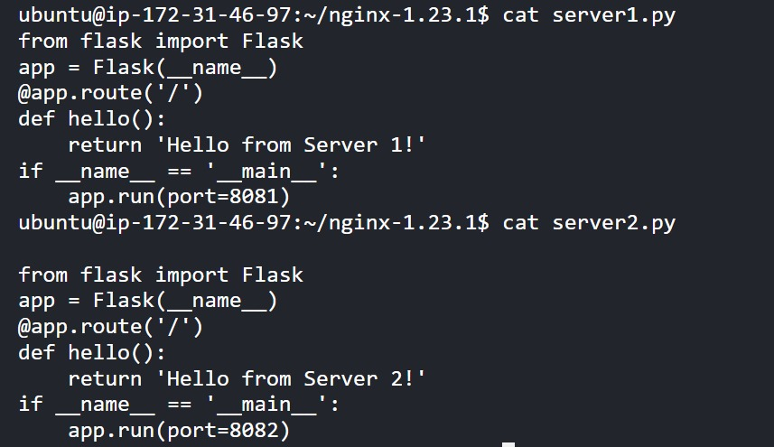
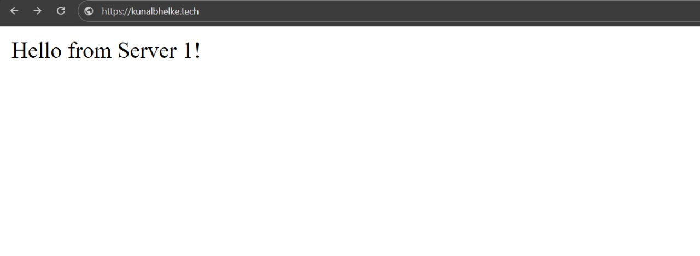

# Assessment-Test-Asian-Group-LLC
## What is DDoS attacks?
* A distributed denial-of-service (DDoS) attack is a malicious attempt to disrupt the normal traffic of a targeted server, service or network by overwhelming the target or its surrounding infrastructure with a flood of Internet traffic.


## a. CC (Challenge Collapsar) Attack:
---------------------
### Cause:

The CC attack is caused by overwhelming a targeted server with a large number of connections that are seemingly legitimate but are crafted to exploit the server's resources inefficiently.
### Identify:

Identify a CC attack by monitoring the server's connection table. A sudden spike in connections or a rapid increase in the number of connections per second can be indicative of a CC attack.
### Effect:

The effect of a CC attack is a degradation of server performance or a complete denial of service. The server becomes unable to process legitimate requests due to the overload caused by the large number of malicious connections.
### Mitigation:

Mitigate CC attacks by implementing rate limiting or connection rate thresholds. This involves setting limits on the number of connections a single IP address can establish within a specific time frame. Additionally, using web application firewalls (WAFs) can help filter out malicious traffic.

---------------------------------
## b. SYN Flood Attack:
----------------------------
### Cause:

SYN Flood attacks exploit the three-way handshake process in the TCP protocol. Attackers flood a server with a large number of TCP connection requests (SYN packets), but they do not complete the handshake process, leaving the server's resources tied up with incomplete connections.

### Identify:

Identify SYN Flood attacks by monitoring the number of half-open connections. An abnormally high number of half-open connections compared to the normal pattern indicates a SYN Flood attack.

### Effect:

The effect of a SYN Flood attack is the exhaustion of the server's resources, particularly its ability to process new legitimate connection requests. This can lead to service degradation or a complete denial of service.

### Mitigation:

Mitigate SYN Flood attacks by implementing SYN cookies or employing dedicated hardware solutions, such as firewalls or intrusion prevention systems (IPS), capable of identifying and mitigating such attacks. Load balancers can also distribute incoming connections evenly, preventing a single server from being overwhelmed.

----------------------------------
## c. SSL Attack:
--------------------------------
### Cause:

SSL attacks can take various forms, including exploiting vulnerabilities in the SSL/TLS protocols or using resource-intensive cipher suites. These attacks aim to compromise the security of encrypted communication channels.

### Identify:

Identify SSL attacks by monitoring for unusual patterns in encrypted traffic or by detecting anomalies in the SSL/TLS handshake process. Unusual certificate changes or unexpected renegotiations may indicate an SSL attack.

### Effect:

The effect of an SSL attack can range from eavesdropping on encrypted communications to the complete compromise of the confidentiality and integrity of sensitive information.

### Mitigation:

Mitigate SSL attacks by keeping software and systems updated to patch known vulnerabilities. Employing strong encryption algorithms and ciphers, and regularly updating SSL/TLS configurations, helps enhance security. Additionally, using intrusion detection and prevention systems to monitor and block malicious SSL traffic can be effective. Always use reputable SSL certificates and ensure proper certificate management practices are in place. Regular security audits and penetration testing are also recommended.

# Tasks
* On an Ubuntu system install Nginx 1.23.1 from a source file (Not using APT) and 
create a small test infrastructure on your virtual environment to perform a load 
balancing of a site example.com using Nginx. 
Share the steps and screenshots of the configuration and the result identifying the load 
has been distributed among backend servers. 

* Requirements to perform this task
    1. nginx 1.23.1 source package
    2. python3-pip
    3. flask
    4. nginx loadbalancing.

------------------------------------------------------------
## Download and extract Nginx source code
```shell
sudo apt-get update
sudo apt-get install -y build-essential libpcre3 libpcre3-dev zlib1g zlib1g-dev openssl libssl-dev
# Download Nginx source code
wget http://nginx.org/download/nginx-1.23.1.tar.gz
tar -zxvf nginx-1.23.1.tar.gz
cd nginx-1.23.1

# Configure and compile
./configure
make
sudo make install

# check nginx installed version
sudo /usr/local/nginx/sbin/nginx -v
```
--------------------------


-----------------------------
## Backend servers
For demonstration purposes, let's assume you have two backend servers running on different ports. You can simulate this using simple Python HTTP servers:

* Start two backend servers
First, install Flask if you haven't already:
```shell
sudo apt install python3-pip
pip install Flask
```

* Now, create two Python scripts, e.g., server1.py and server2.py, with the following content:
```shell
----------------
vi server1.py:
-------------------------
from flask import Flask

app = Flask(__name__)

@app.route('/')
def hello():
    return 'Hello from Server 1!'

if __name__ == '__main__':
    app.run(port=8081)

------------------------    
vi server2.py:
--------------------
from flask import Flask

app = Flask(__name__)

@app.route('/')
def hello():
    return 'Hello from Server 2!'

if __name__ == '__main__':
    app.run(port=8082)
---------------------------------------------

```


----------------------------------
## Now, start these Flask servers:
```shell 

python3 server1.py &
python3 server2.py &
```
* This will start two Flask servers on ports 8081 and 8082.
----------------------------------------------------
## Nginx Configuration for Load Balancing
    * Create a new Nginx configuration file or edit the existing, e.g., /usr/local/nginx/conf/nginx.conf
```shell 

#create a file named nginx.conf 

http {
    upstream backend {
        server 127.0.0.1:8081;
        server 127.0.0.1:8082;
        # Add more backend servers as needed
    }

    server {
        listen 80;

        location / {
            proxy_pass http://backend;
            proxy_http_version 1.1;
            proxy_set_header Upgrade $http_upgrade;
            proxy_set_header X-Real-IP $remote_addr;
            proxy_set_header Host $host;
        }
    }
}
```

* Start Nginx
```shell
sudo /usr/local/nginx/sbin/nginx
#if there is any modification in the file then 
sudo /usr/local/nginx/sbin/nginx -s reload
```
-------------------------

## Verify load balancing
    * Open a web browser and hit the domain, Refresh the page multiple times, and you should see the requests being distributed between the two backend servers.



-------------------------------


* Here is the complete nginx proxy and loadbalancing done. 